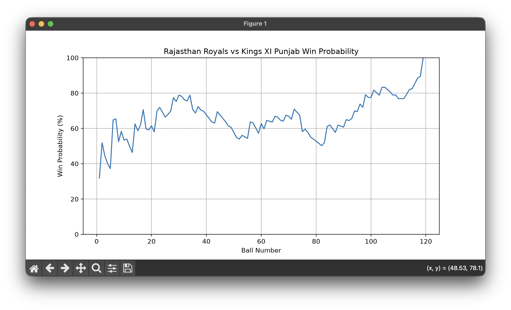
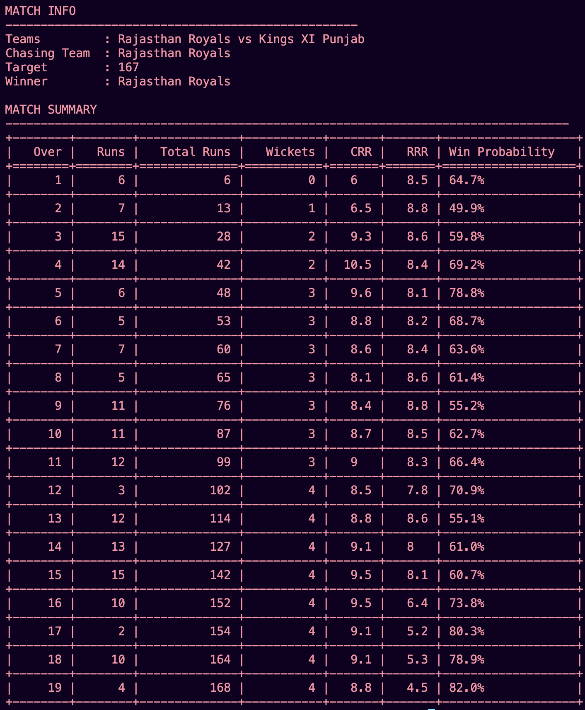

# IPL Win Probability Engine 🏏


A Python-based IPL win probability prediction engine that calculates the chasing team's win probability after every delivery.

The project processes ball-by-ball IPL data, generates match states, and visualizes how win probability changes throughout the innings.

---

## Features

- Load IPL ball-by-ball delivery data
- Process individual matches and innings
- Calculate match state after every ball:

  - Runs scored
  - Wickets lost
  - Runs required
  - Balls remaining
  - Current Run Rate
  - Required Run Rate

- Rule-based probability model using:
  - Weighted advantage scoring
  - Sigmoid function

- Ball-by-ball win probability visualization

---

## Tech Stack

- Python
- NumPy
- Matplotlib
- Object-Oriented Programming
- CSV Data Processing

---

## Project Structure
```text
ipl-win-probability-engine/

├── src/
│   ├── data_loader.py
│   ├── match_engine.py
│   ├── probability.py
│   └── visualiser.py

├── main.py
├── requirements.txt
├── README.md
└── .gitignore


---

## How It Works

```text
IPL Dataset
     |
     ↓
DataLoader
     |
     ↓
MatchEngine
     |
     ↓
Match State
     |
     ↓
ProbabilityEngine
     |
     ↓
Win Probability Graph
```

---

## Installation

Clone the repository:

```bash
git clone <repository-url>
```

Install dependencies:

```bash
pip install -r requirements.txt
```

Run the project:

```bash
python main.py
```

---

## Example Output

The model generates a ball-by-ball win probability graph showing how the chasing team's chances change during the match.




---

## Future Improvements

- Add team logos
- Improve probability accuracy
- Replace rule-based model with machine learning model

---

## Author

Chiranjeevi S Gowda
